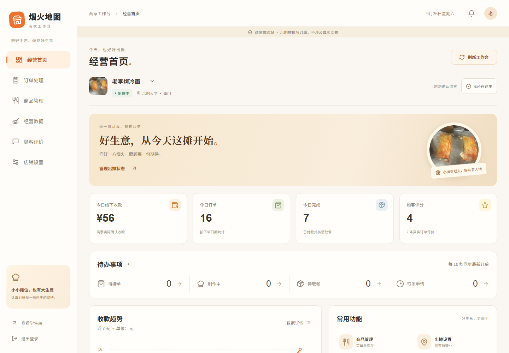
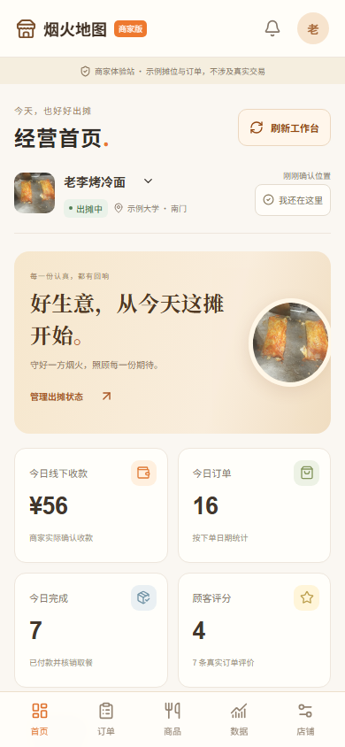

# 商家端验收记录

本次交付包含经营首页、订单处理、商品管理、经营数据、顾客评价、店铺设置，并保持学生端交易流程兼容。

- 前端 TypeScript 检查与生产构建通过。
- 后端完整用例 37 项：33 项通过，4 项 PostgreSQL 专用并发用例在本次 SQLite 开发环境跳过。本轮未重新进行 PostgreSQL 验证。
- 浏览器用例 19 项均获得通过结果：全站回归前 11 项通过后，本地 Vite 后台进程退出导致后 8 项连接失败；改用持续运行的终端会话后，定向重跑这 8 项全部通过（17.7 秒）。不是一次无失败的完整运行。
- 360、390、768、1440 宽度下的六个商家页面均检查无横向溢出；商品编辑与订单抽屉另做手机视觉检查。
- 完整双角色流程覆盖接单、制作、出餐、线下收款确认、取餐码核销及学生评价；校验商家接口不泄漏取餐码，改价不回写旧库存，订单快照不随菜单修改。
- 商家专项覆盖真实图片上传与持久化、上下架同步、公开评价回复与撤回、多设备资料编辑互不覆盖、仅更改收摊时间不改位置、CSV 日报与实际数据一致。
- 后端专项覆盖越权操作、图片格式与大小校验、跨日收款归属、暂歇位置过期后保持暂歇、营业会话到点结束后重新开摊。

预览地址：http://127.0.0.1:5183/merchant 。体验账号 `vendor`，密码 `demo12345`。目前预览采用持久终端会话；隐藏后台启动的 Vite 曾出现无错误日志退出，现有证据不足以确定其退出原因。需手动启动时可在前端目录执行 `npm run dev -- --host 127.0.0.1` 并保留终端；后端与超时任务按根目录 README 启动。

正式地图、生产 HTTPS 和真实商户试运营不在本次本地验收范围。

