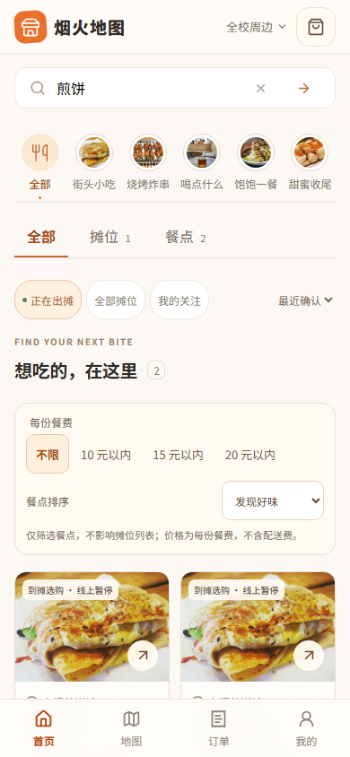
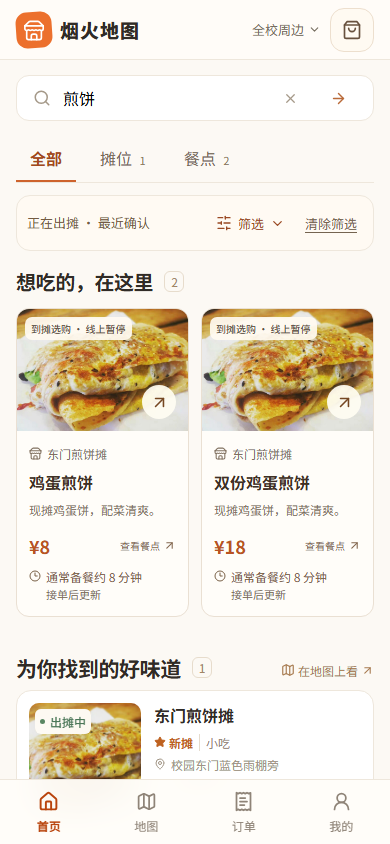
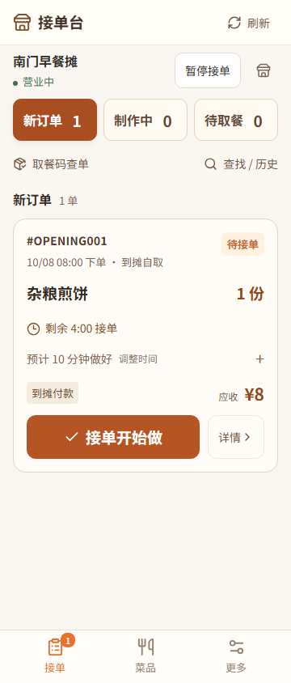
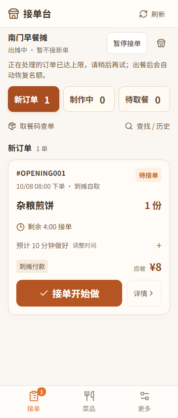
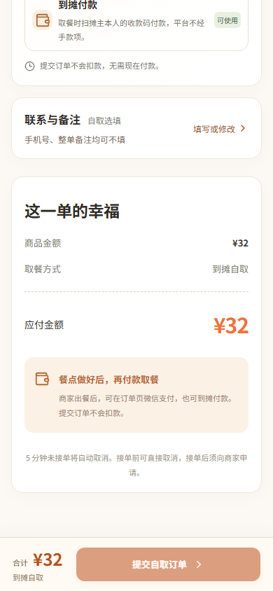
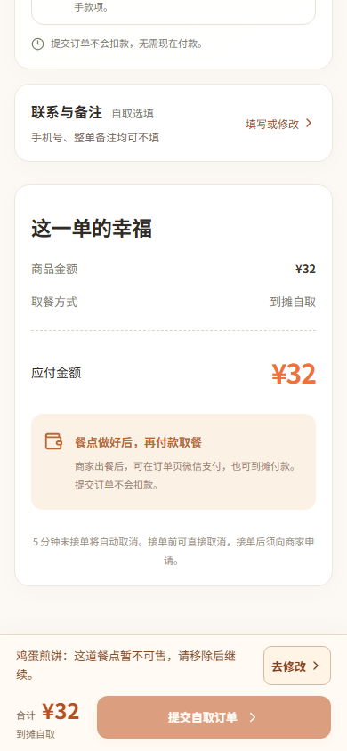
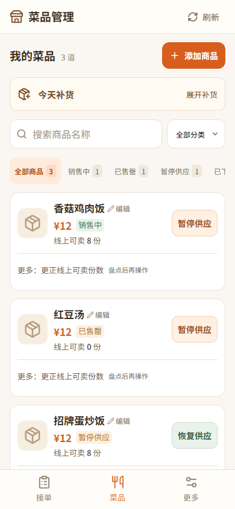
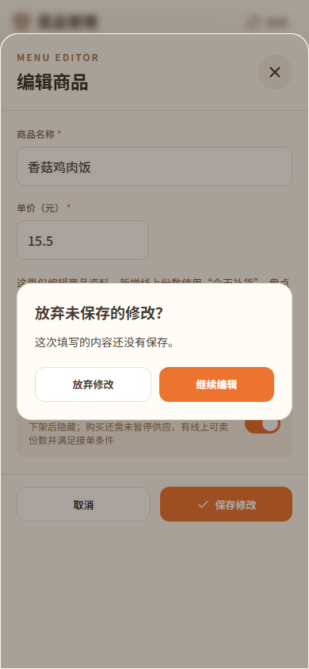

# 手机两端流程完善（2026-10-08）

本轮基于公开 PR #1 的 `36aa0cbb39847039017e3ab2702022ab1cb5ba54`，按已确认的六项计划修改前端。首页大图、品类布局、暖橙配色、图片与上一轮菜单首屏/加购流程保持原样；没有修改后端 API、数据库、业务状态机，也没有生产部署。

## 实际改动

1. **搜索**：手机先显示搜索框、结果类型、条件摘要与结果。品类、出摊状态、预算及排序在原处展开，修改立即生效；收起仍可查看/清除条件，切换结果类型保留预算和排序。预算仅发给餐点接口。桌面默认展开，混合结果的空类别使用简短提示，两类读取失败各自重试。
2. **详情返回**：按照真实来源显示返回搜索、地图、菜单、餐袋或订单确认。仅在同标签页内存记录历史条目、账号/校园范围、筛选、页数、目标 ID、点击入口及位置；刷新、直接链接、身份/校园变化使用默认入口。不缓存营业、价格、库存或付款数据。返回重新读取，最多恢复到原页数，5 秒截止，失败、目标消失或用户操作取消定位。地图重新读取所选摊位后显示指引，并恢复地图视角和列表自身滚动。
3. **结算纠错**：底栏按摊位接单状态、餐点/份数、口味、配送及联系资料的顺序说明问题。“去修改”展开并聚焦现有控件；位置等问题提供查看摊位入口。价格变化仍需确认，提交中、未知结果和原订单恢复不出现额外提交入口。底部留白按操作栏实际高度调整。
4. **真实接单状态**：营业中但服务端 `can_order=false` 时显示当前不接新单及具体原因，保留设置和已有订单操作，不改变接单开关、截止时间或位置确认。
5. **订单筛选**：收起查找后保留搜索词、取餐方式及清除入口。清除仅重置这两项，保留订单阶段/历史分类；从历史订单进入时展开选择区，说明搜索只覆盖已加载记录。正常接单无额外筛选时不增加说明高度。
6. **编辑保护**：关闭、取消、遮罩和 Escape 统一确认未保存改动，默认聚焦继续编辑并约束键盘焦点。保存/上传中禁止关闭，成功后直接关闭。编辑 PATCH 结果未知时不声称未保存，关闭并刷新供商家核对；普通放弃修改不清除新增商品的独立幂等恢复记录。

## 前后截图

相同合成 API 数据、固定时钟、Chromium、844px 高视口，分别访问基线与本轮页面。28 个对照场景通过，保存 23 对截图及逐图 DOM 指标；业务写请求和未匹配 API 均为 0，没有访问真实业务数据。

| 指标 | 360px：之前 → 之后 | 390px：之前 → 之后 |
| --- | --- | --- |
| 搜索第一道菜价格下缘 | 894 → 548px | 887 → 559px |
| 正常接单主按钮下缘 | 567 → 567px | 567 → 567px |
| 容量已满时已有订单主按钮下缘 | 567 → 619px | 567 → 619px |

手机底部导航上沿为 779px，新搜索首项名称与价格、商家已有订单主操作均完整可见。首页大图四种宽度的尺寸与基线一致。库存异常结算在滚到底部时仍可见原因和修改入口，最后一段说明未被底栏遮挡。

代表截图均使用虚构摊位/订单及原有示例图片，不是商家实拍或真实交易：

| 场景 | 之前 | 之后 |
| --- | --- | --- |
| 搜索 390px |  |  |
| 接单容量已满 360px |  |  |
| 库存异常结算底部 390px |  |  |
| 编辑误关 390px |  |  |

768/1440px 搜索依计划默认展开筛选，在此次 844px 高视口中第一道餐点仍需滚动；手机首屏结论不能推广到桌面。768px 首页横幅已有副文案下缘裁切，前后相同，本轮按范围保持首页布局并记录此问题。

## 验证记录

- 类型检查与生产构建通过；前端单元测试 15/15。
- 已在 Chromium/WebKit 定向验证筛选收起、分页返回、地图更新/失败、实际入口焦点、用户滚动/5秒截止、账号/校园切换、价格与库存变化、配送资料缺失、重复提交、未知结果、编辑误关和保存/上传中关闭。
- 360、390、768、1440px 检查主要操作尺寸、键盘焦点和底栏遮挡。另验证地图 14 条摘要、非零列表滚动、中心/缩放恢复。
- 本地 CI 配置完整回归 **450/450**（9.0 分钟），包含 Chromium、WebKit 和生产构建启动；随后新增的地图独立滚动/视角用例在两种浏览器各 **1/1**。当前 CI 选择共 452 项。
- 原隔离真实 API 验证脚本在 Node **24.19.0** 下 **15/15**（57.8 秒），临时数据库、媒体和自有服务正常清理。
- 远端 CI 以 [PR #1 当前提交检查页](https://github.com/tangtaizong666/yanhuo-map/pull/1/checks) 为准；本地完成时尚未执行，最终结果记录在 PR 描述。

首轮真实 API 14/15：唯一失败是旧测试寻找“返回小摊”，页面已按计划显示“返回订单确认”。更新测试导航步骤并保留原有手机号、备注、餐袋与退出清理断言。

随后 Node 24.15.0 两次隔离前端服务中途断连，分别留下 4 通过/7 失败/4 未执行、2 通过/9 失败/4 未执行。进程观测捕获第二次 Vite 退出码 `0xC0000409`，业务 API 请求随即连接拒绝；不能据此认定应用错误、栈溢出或外部清理。相同应用、原脚本与原断言，仅为该进程使用本机已提供的 Node 24.19.0 后 15/15 通过，Vite 正常退出 0。原生异常的具体根因仍未确证，没有改全局 Node、项目依赖或测试断言来掩盖异常。原始失败追踪与进程观测日志均保留在本地验证归档。

本地定向开发期失败证据均保留：旧选择器、金额显示格式预期、遮罩关闭焦点和一次开发服务器热更新。修复后使用原业务/焦点断言重新验证，没有增加自动重试或放宽容差。

## 同步与后续

只将本轮公开前端、相关测试和这份说明同步到既有 PR #1；不上传根目录历史私有文件、配置、数据库或真实用户资料。

网页咨询默认要求核实 GPT-6 Extra High。当前浏览器控制初始化报 `failed to write kernel assets: 系统找不到指定的路径。(os error 3)`，尚未能核实或发送；不以其他模型代替，不消耗 Pro 来绕过。

自动化与合成截图不能替代真实商户试用、实体手机软键盘或真实收付款验收。本轮不安排试用或生产部署。
